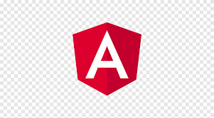

## Hello World! 👋, I'm Lidia Hernández!

I am a versatilist and easily adapt to different hats (Full Stack Web Developer or beginner level Designer 🎨) depending on what the project requires. I love exploring new tech stack and leveraging them to build cool stuffs. 
 
 
 
### More About Me:

- 🌱 &nbsp; I’m currently learning Typescript; 
- 💬 &nbsp; Ask me about anything tech related, I am happy to help;
- 📝 &nbsp; Checkout my [resume]()
- 📚 &nbsp; When I am free, I read classic novels, I collects leaves and play with cats. 

<h2>Favorite Tech</h2>

> Tools, languages, and other things that I like to work with.

<table>
  <tr>
    <td align="center" width="96">
      
       Java
    </td>
    <td align="center" width="96">
      
       Spring
    </td>
    <td align="center" width="96">
      
       Python
    </td>
    <td align="center" width="96">
      
       Angular
    </td>
    <td align="center" width="96">
      
       TypeScript
    </td>
    <td align="center" width="96">
      
       JavaScript
    </td>
    <td align="center" width="96">
      
       JQuery
    </td>
    <td align="center" width="96">
      
       Bootstrap
    </td>
    <td align="center" width="96">
      
       Sass
    </td>
  </tr>
<tr>
    <td align="center" width="96">
      
       SQL Server
    </td>
    <td align="center" width="96">
      
       MySQL
    </td>
    <td align="center" width="96">
      
       HTML
    </td>
    <td align="center" width="96">
      
       Django
    </td>
    <td align="center" width="96">
      
       Linux
    </td>
    <td align="center" width="96">
      
       Docker
    </td>
    <td align="center" width="96">
      
       Swagger
    </td>
    <td align="center" width="96">
      
       Postman
    </td>
    <td align="center" width="96">
      
       PostgreSQL
    </td>
  </tr>
</table>
